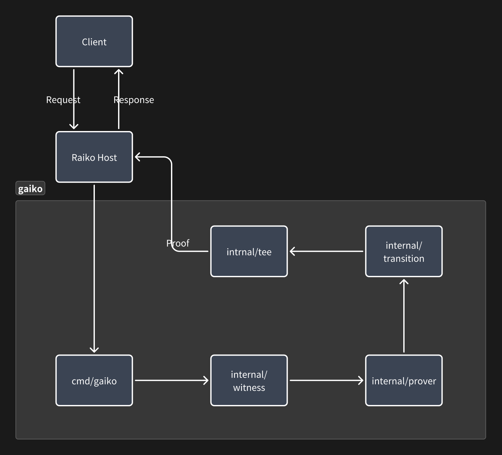

# Gaiko is Golang port of Raiko

## Architecture

```text
$ tree -d
.
├── cmd
│   └── gaiko
├── ego
├── internal
│   ├── flags
│   ├── prover
│   ├── tee
│   ├── transition
│   ├── types
│   ├── version
│   └── witness
├── pkg
│   ├── keccak
│   └── mpt
└── test
    └── fixtures
        ├── batch
        └── single
```

- `cmd/gaiko` `gaiko` cli entry
- `ego` artifacts, e.g. config
- `internal/flags` cli arguments
- `internal/prover` prover abstracts, the core logic of `gaiko`
- `internal/tee` TEE provider, `tdx`, `gramine` or `ego`, compile with `-tags dev` to use `dev` mode
- `internal/transition` state transition of blocks
- `internal/types` type bridge between `raiko` and `gaiko`
- `internal/version` cli version helper
- `internal/witness` proof witness, aka: `Batch/GuestInput` in `raiko`
- `pkg/keccak` pooled keccak hasher
- `pkg/mpt` the golang porting of merkle trie from `raiko`

## Data Flow(Oneshot)



## Command Help

```text
$ ./gaiko
NAME:
   gaiko - The Gaiko command line interface

USAGE:
   gaiko [global options] command [command options]

VERSION:
   1.14.11-stable

COMMANDS:
   one-shot        Run state transition once
   one-batch-shot  Run multi states transition once
   aggregate       Run the aggregate process
   bootstrap       Run the bootstrap process
   check           Run the check process
   help, h         Shows a list of commands or help for one command

GLOBAL OPTIONS:
   --secret-dir value  Directory for the secret files (default: /Users/xus/.config/gaiko/secrets)
   --config-dir value  Directory for configuration files (default: /Users/xus/.config/gaiko/config)
   --sgx-type value    Which SGX type? ego or gramine [$SGX_TYPE]
   --help, -h          show help
   --version, -v       print the version

COPYRIGHT:
   Copyright 2025 The Gaiko Authors
```
